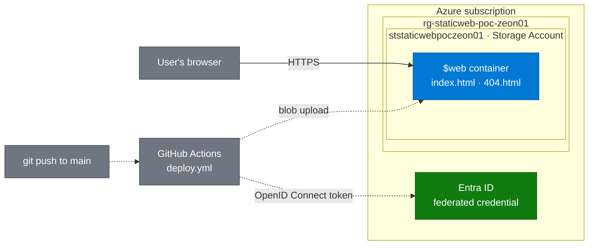

# Azure Static Website Proof of Concept

[](https://github.com/zsociety47/azure-static-website-poc/actions/workflows/deploy.yml)

**Live site:** LIVE_SITE_LINK_HERE · **Walkthrough:** [Loom](LOOM_LINK_HERE) · **Author:** Zeon Stewart, [LinkedIn](LINKEDIN_LINK_HERE)

A serverless static website hosted on Azure Blob Storage, deployed automatically by GitHub Actions on every push to `main`. GitHub signs in to Azure with OpenID Connect (OIDC), so no passwords, keys, or connection strings are stored anywhere.

Part of [Cloud Projects](https://github.com/zsociety47/cloud-projects).

---

## Hypothesis

A static website can be hosted on Azure Storage with no web server to manage, and deployed from GitHub Actions without storing any long-lived credentials, using only a narrowly scoped role on a single storage account.

## Success criteria

| # | Criterion | How it is checked | Result |
|---|-----------|-------------------|--------|
| 1 | The site loads over Hypertext Transfer Protocol Secure (HTTPS) from the storage account's static website endpoint | Open the live site link | |
| 2 | Missing pages return the custom 404 page | Visit `/does-not-exist` | |
| 3 | A push to `main` updates the live site with no manual steps | Uncomment the "Deployed automatically" line, push, refresh | |
| 4 | No passwords, keys, or connection strings are stored in GitHub or the repository | Review repository secrets and workflow | |
| 5 | The deploy identity can only write to this one storage account | Review its role assignments in Azure | |
| 6 | The whole environment is created and removed by scripts | Run `deploy.sh`, `setup-oidc.sh`, and `teardown.sh` | |

---

## Architecture



*Visitors reach the site over HTTPS from the storage account's static website endpoint (solid line). Code changes reach the same container through GitHub Actions, which signs in with a short-lived OpenID Connect token instead of a stored password (dashed lines).*

*Diagram follows the [shared diagram standard](https://github.com/zsociety47/cloud-projects/blob/main/standards/DIAGRAM-STANDARD.md).*

---

## What's in this repository

```
.
├── site/
│   ├── index.html          Home page
│   └── 404.html            Custom "page not found" page
├── scripts/
│   ├── deploy.sh           Creates the resource group and storage account, enables hosting, uploads site/
│   ├── setup-oidc.sh       Creates the identity GitHub Actions signs in as, and its permissions
│   └── teardown.sh         Deletes everything the two scripts above created
└── .github/
    ├── workflows/
    │   └── deploy.yml      Continuous integration and continuous deployment (CI/CD) pipeline
    └── dependabot.yml      Weekly check for newer GitHub Actions versions
```

---

## How to deploy it yourself

**Prerequisites:** an Azure subscription where you are Owner (or Contributor plus User Access Administrator), the Azure command-line interface (CLI) signed in with `az login`, and the GitHub CLI (`gh`) signed in with `gh auth login`.

**1. Create the Azure resources and upload the site**

```bash
./scripts/deploy.sh <suffix>        # suffix: 2-8 lowercase letters or digits, e.g. zs01
```

The script prints the live site address and the storage account name.

**2. Let GitHub Actions sign in to Azure**

```bash
./scripts/setup-oidc.sh <github-owner>/<repo> <storage-account-name>
```

**3. Save the printed values in GitHub**

```bash
gh secret set AZURE_CLIENT_ID          # paste each value when prompted
gh secret set AZURE_TENANT_ID
gh secret set AZURE_SUBSCRIPTION_ID
gh variable set STORAGE_ACCOUNT_NAME --body <storage-account-name>
gh variable set SITE_URL --body <live-site-address>
```

**4. Push to `main`.** The workflow uploads `site/` and the live site updates within a minute.

---

## Security choices

- **OpenID Connect instead of stored secrets.** Each workflow run gets a token from GitHub that expires in minutes. Azure trusts it only if it comes from this repository deploying to the `production` environment.
- **Least privilege with role-based access control (RBAC).** The deploy identity has only the Storage Blob Data Contributor role, scoped to this one storage account. It cannot change settings, delete the account, or reach anything else in the subscription.
- **No storage account keys.** Both the scripts and the workflow upload with `--auth-mode login`, which uses the signed-in identity's role instead of the account's master key.
- **Hardened storage account.** HTTPS only, minimum Transport Layer Security (TLS) version 1.2, and anonymous public access to blobs turned off. The static website endpoint still serves the site.
- **Minimal workflow permissions.** The workflow token can only read the code and request an OpenID Connect token.

## Cost and redundancy

The storage account uses locally redundant storage (LRS): three copies of the data in one datacenter. It is the cheapest option and costs cents per month for a site this size. Production sites might choose zone-redundant storage (ZRS), which spreads copies across three availability zones in a region, or geo-redundant storage (GRS), which adds a second copy in another region.

## Going further

- **Custom domain with HTTPS:** put Azure Front Door, Microsoft's global content delivery network (CDN) and entry point, in front of the static website endpoint.
- **Infrastructure as code:** replace the scripts with a Bicep template.

---

## Findings

*To be written after the deployment is tested.*

---

## Teardown

```bash
./scripts/teardown.sh <suffix>
```

Deletes the resource group (storage account and site) and the app registration GitHub signed in as. The live site link stops working immediately.
