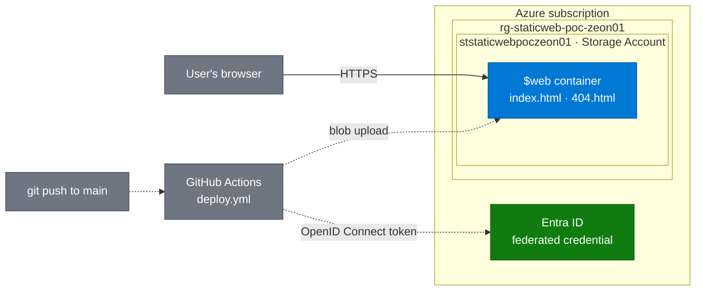

# Azure Static Website Proof of Concept

[](https://github.com/zsociety47/azure-static-website-poc/actions/workflows/deploy.yml)

**Live site:** [ststaticwebpoczeon01.z13.web.core.windows.net](https://ststaticwebpoczeon01.z13.web.core.windows.net/) · **Walkthrough:** [Loom](LOOM_LINK_HERE) · **Author:** Zeon Stewart, [LinkedIn](LINKEDIN_LINK_HERE)

## At a glance

- **What it is:** a website that runs directly from Microsoft Azure's file storage, with no server to rent, patch, or keep running.
- **What's automated:** every time I save a change to GitHub, the live site updates itself in under a minute.
- **Why it's secure:** GitHub proves who it is to Azure on every update, so there are no passwords or keys that could leak.
- **Result:** every goal was met. The last one, automated cleanup, runs after the walkthrough is recorded.

Part of [Cloud Projects](https://github.com/zsociety47/cloud-projects). Technical details and lessons learned are in [Technical findings](#technical-findings) at the bottom.

---

## Hypothesis

A static website can be hosted on Azure Storage with no web server to manage, and deployed from GitHub Actions without storing any long-lived credentials, using only a narrowly scoped role on a single storage account.

## Success criteria

| # | Criterion | How it is checked | Result |
|---|-----------|-------------------|--------|
| 1 | The site loads over Hypertext Transfer Protocol Secure (HTTPS) from the storage account's static website endpoint | Open the live site link | ✅ |
| 2 | Missing pages return the custom 404 page | Visit `/does-not-exist` | ✅ |
| 3 | A push to `main` updates the live site with no manual steps | Uncomment the "Deployed automatically" line, push, refresh | ✅ |
| 4 | No passwords, keys, or connection strings are stored in GitHub or the repository | Review repository secrets and workflow | ✅ |
| 5 | The deploy identity can only write to this one storage account | Review its role assignments in Azure | ✅ |
| 6 | The whole environment is created and removed by scripts | Run `deploy.sh`, `setup-oidc.sh`, and `teardown.sh` | ✅ created · ⏳ teardown pending |

---

## Architecture



*Visitors reach the site over HTTPS from the storage account's static website endpoint (solid line). Code changes reach the same container through GitHub Actions, which signs in with a short-lived OpenID Connect token instead of a stored password (dashed lines).*

*Diagram follows the [shared diagram standard](https://github.com/zsociety47/cloud-projects/blob/main/standards/DIAGRAM-STANDARD.md).*

---

## What's in this repository

```
.
├── site/
│   ├── index.html          Home page
│   └── 404.html            Custom "page not found" page
├── docs/
│   └── manual-setup.md     The same build done by hand in the Azure portal
├── scripts/
│   ├── deploy.sh           Creates the resource group and storage account, enables hosting, uploads site/
│   ├── setup-oidc.sh       Creates the identity GitHub Actions signs in as, and its permissions
│   └── teardown.sh         Deletes everything the two scripts above created
└── .github/
    ├── workflows/
    │   └── deploy.yml      Continuous integration and continuous deployment (CI/CD) pipeline
    └── dependabot.yml      Weekly check for newer GitHub Actions versions
```

---

## Build it yourself

There are two ways to build this. Start with the manual way to see what each piece is, then use the scripts to do the same thing in a repeatable way.

### Option 1: Manual setup in the Azure portal

Follow the click-by-click **[manual setup guide](docs/manual-setup.md)**. It builds the site in the Azure portal, then connects GitHub Actions, and each step names the script line that automates it.

### Option 2: Automated setup with scripts

**Prerequisites:** an Azure subscription where you are Owner (or Contributor plus User Access Administrator), the Azure command-line interface (CLI) signed in with `az login`, and the GitHub CLI (`gh`) signed in with `gh auth login`.

**1. Create the Azure resources and upload the site**

```bash
./scripts/deploy.sh <suffix>        # suffix: 2-8 lowercase letters or digits, e.g. zs01
```

The script prints the live site address and the storage account name.

**2. Let GitHub Actions sign in to Azure**

```bash
./scripts/setup-oidc.sh <github-owner>/<repo> <storage-account-name>
```

**3. Save the printed values in GitHub**

```bash
gh secret set AZURE_CLIENT_ID          # paste each value when prompted
gh secret set AZURE_TENANT_ID
gh secret set AZURE_SUBSCRIPTION_ID
gh variable set STORAGE_ACCOUNT_NAME --body <storage-account-name>
gh variable set SITE_URL --body <live-site-address>
```

**4. Push to `main`.** The workflow uploads `site/` and the live site updates within a minute.

**5. When you're done, tear it down.** See [Teardown](#teardown).

---

## Security choices

- **OpenID Connect instead of stored secrets.** Each workflow run gets a token from GitHub that expires in minutes. Azure trusts it only if it comes from this repository deploying to the `production` environment.
- **Least privilege with role-based access control (RBAC).** The deploy identity has only the Storage Blob Data Contributor role, scoped to this one storage account. It cannot change settings, delete the account, or reach anything else in the subscription.
- **No storage account keys.** Both the scripts and the workflow upload with `--auth-mode login`, which uses the signed-in identity's role instead of the account's master key.
- **Hardened storage account.** HTTPS only, minimum Transport Layer Security (TLS) version 1.2, and anonymous public access to blobs turned off. The static website endpoint still serves the site.
- **Minimal workflow permissions.** The workflow token can only read the code and request an OpenID Connect token.

## Cost and redundancy

The storage account uses locally redundant storage (LRS): three copies of the data in one datacenter. It is the cheapest option and costs cents per month for a site this size. Production sites might choose zone-redundant storage (ZRS), which spreads copies across three availability zones in a region, or geo-redundant storage (GRS), which adds a second copy in another region.

## Going further

- **Custom domain with HTTPS:** put Azure Front Door, Microsoft's global content delivery network (CDN) and entry point, in front of the static website endpoint.
- **Infrastructure as code:** replace the scripts with a Bicep template.

---

## Teardown

If you build your own copy, tear it down when you're finished with it:

```bash
./scripts/teardown.sh <suffix>
```

This deletes the resource group (storage account and site) and the app registration GitHub signed in as, and your site's link stops working straight away. If you built it by hand, follow the clean-up steps at the end of the [manual setup guide](docs/manual-setup.md#clean-up-when-youre-done).

The live site linked at the top of this page is kept running on purpose as a working demo.

---

## Technical findings

*For engineers: what actually happened while building this, including the errors.*

- **GitHub's OpenID Connect subject format has changed, and most guides haven't caught up.** The first real deploy failed with `AADSTS700213: No matching federated identity record found`. New GitHub repositories now include permanent owner and repository IDs in the token subject (`repo:zsociety47@122703085/azure-static-website-poc@1396638213:environment:production`), but the federated credential used the older name-only format (`repo:zsociety47/azure-static-website-poc:environment:production`) that most tutorials still show. The workflow log printed the subject GitHub actually sent, which made the mismatch easy to spot. `setup-oidc.sh` now asks GitHub for the exact subject, so it works with both formats.
- **New role assignments are not instant.** The first upload in `deploy.sh` was refused with "You do not have the required permissions" seconds after the Storage Blob Data Contributor role was granted, then succeeded on retry 30 seconds later. Automation that grants a role and uses it straight away needs a retry. The error message also suggested switching to `--auth-mode key`, which would have worked but defeated the point of the project.
- **Being Owner of the subscription is not the same as being able to write files.** Owner covers management actions such as creating the storage account and turning on static website hosting, but uploading blobs with your own identity needs a separate data role. Keeping those two kinds of permission apart is what lets the GitHub identity hold only a data role on one storage account, with no power to change or delete anything else.
- **The pipeline fails closed.** The very first push ran before any Azure credentials existed in GitHub. The workflow stopped at the sign-in step and never reached the upload, so a missing or broken identity can't lead to a partial or unauthorized deploy.
- **`az storage blob upload-batch` only adds and overwrites files.** Deleting a page from `site/` leaves the old copy live on Azure. A future version could use `az storage blob sync` with `--delete-destination true` to mirror the folder exactly.
