# Azure Static Website Proof of Concept

[](https://github.com/zsociety47/azure-static-website-poc/actions/workflows/deploy.yml)

## 🎬 Watch Me Build This Lab!

<!-- [](LOOM_LINK_HERE) -->
*Video walkthrough coming soon.*

**Live site:** [ststaticwebpoczeon01.z13.web.core.windows.net](https://ststaticwebpoczeon01.z13.web.core.windows.net/) · **Author:** Zeon Stewart, [LinkedIn](LINKEDIN_LINK_HERE)

## At a glance

- **What it is:** a website that runs directly from Microsoft Azure's file storage, with no server to rent, patch, or keep running.
- **What's automated:** every time I save a change to GitHub, the live site updates itself in under a minute.
- **Why it's secure:** GitHub proves who it is to Azure on every update, so there are no passwords or keys that could leak.
- **Result:** every goal was met, including building and deleting the whole setup with scripts.

Part of [Cloud Projects](https://github.com/zsociety47/cloud-projects). Technical details and lessons learned are in [Technical findings](#technical-findings) at the bottom.

---

## Project Steps

These steps build the whole project by hand in the [Azure portal](https://portal.azure.com). Doing it by hand once shows what each piece is; the [automated setup](#automated-setup) then does the same thing with three scripts. Each step names the script line that automates it.

Pick a short suffix (2-8 lowercase letters or digits, e.g. `ab01`) and use it wherever you see `<suffix>`. If you also have a scripted build running, use a different suffix so the two don't collide. Portal labels change from time to time; if a button has moved, search for the setting name in the portal's top search bar.

Steps 1-6 host the site. Steps 7-11 connect GitHub Actions so every push deploys automatically.

### Step 1: Create a resource group

*Automated by `az group create` in `scripts/deploy.sh`.*

1. Search for **Resource groups** and select **+ Create**.
2. **Subscription:** the subscription you want to use.
3. **Resource group:** `rg-staticweb-poc-<suffix>`
4. **Region:** East US (or the region closest to you).
5. **Tags** tab: add `project = azure-static-website-poc`, `environment = poc`, `managed-by = portal`, and `owner = <your name>`.
6. Select **Review + create**, then **Create**.

<!-- 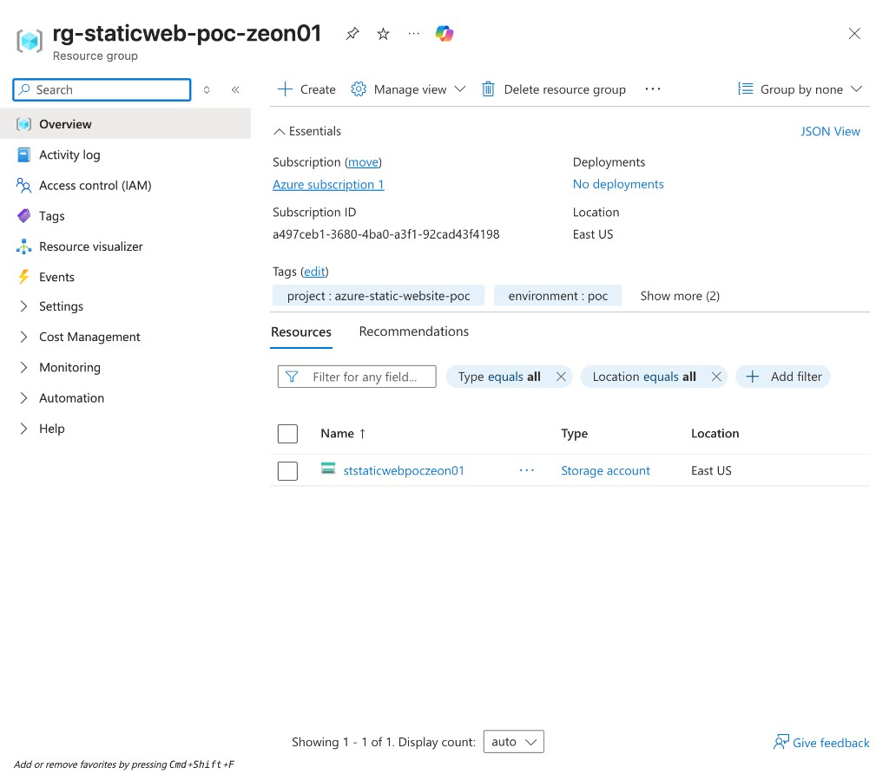 -->

### Step 2: Create a storage account

*Automated by `az storage account create` in `scripts/deploy.sh`.*

1. Search for **Storage accounts** and select **+ Create**.
2. **Basics** tab:
   - **Resource group:** `rg-staticweb-poc-<suffix>`
   - **Storage account name:** `ststaticwebpoc<suffix>` (lowercase letters and digits only, unique across all of Azure)
   - **Region:** the same region as the resource group
   - **Primary service:** Azure Blob Storage or Azure Data Lake Storage Gen2
   - **Performance:** Standard
   - **Redundancy:** Locally-redundant storage (LRS)
3. **Advanced** tab:
   - **Require secure transfer for REST API operations:** on (`--https-only true`). This means Hypertext Transfer Protocol Secure (HTTPS) only.
   - **Allow enabling anonymous access on individual containers:** off (`--allow-blob-public-access false`)
   - **Minimum TLS version:** Version 1.2 (`--min-tls-version TLS1_2`). TLS is Transport Layer Security, the encryption behind HTTPS.
4. **Tags** tab: the same four tags as the resource group.
5. Select **Review + create**, then **Create**. Wait for "Your deployment is complete" and select **Go to resource**.

<!-- 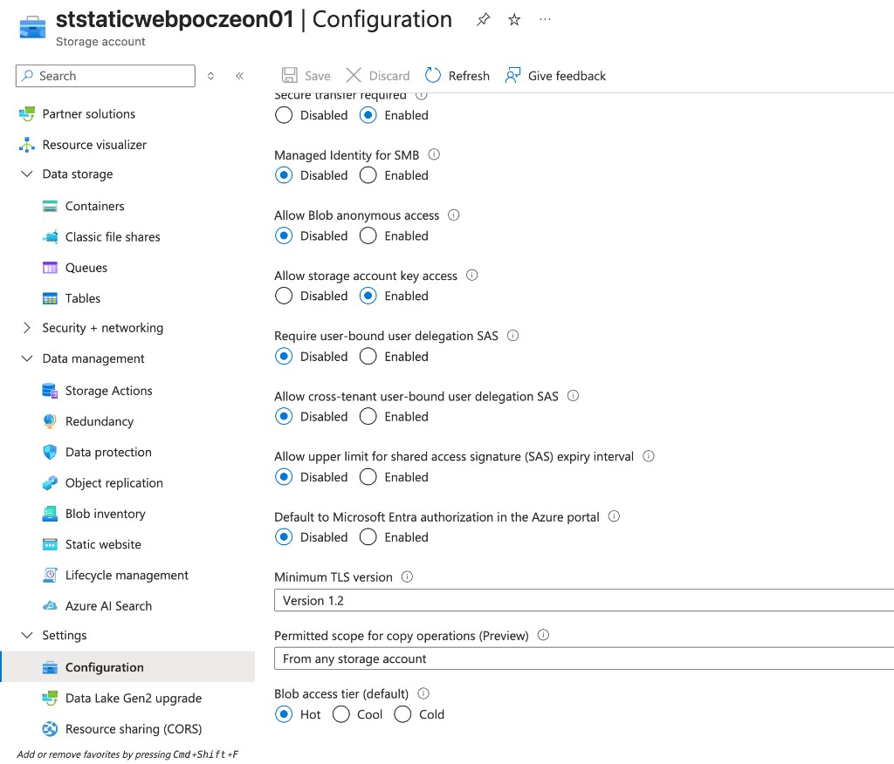 -->

### Step 3: Enable static website hosting

*Automated by `az storage blob service-properties update --static-website` in `scripts/deploy.sh`.*

1. In the storage account menu, open **Data management > Static website**.
2. Set **Static website** to **Enabled**.
3. **Index document name:** `index.html`
4. **Error document path:** `404.html`
5. Select **Save**. Copy the **Primary endpoint**; this is the site address. Azure also creates a container named `$web`.

<!-- 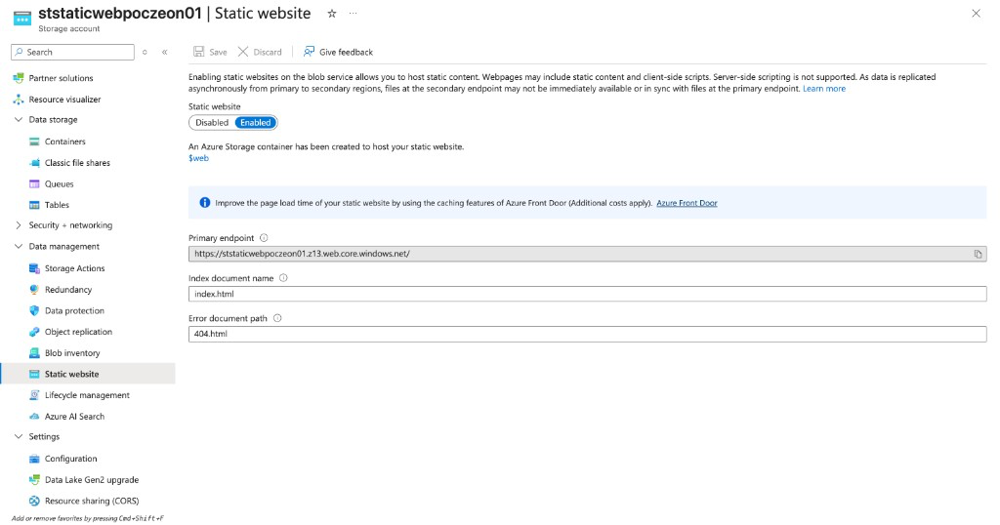 -->

### Step 4: Give yourself permission to upload

*Automated by `az role assignment create` in `scripts/deploy.sh`.*

Being Owner of the subscription does not let you read or write files with your own identity; that needs a data role.

1. In the storage account menu, open **Access control (IAM)** (identity and access management).
2. Select **+ Add > Add role assignment**.
3. **Role** tab: search for and select **Storage Blob Data Contributor**, then **Next**.
4. **Members** tab: **Assign access to** User, group, or service principal. Select **+ Select members**, choose your own account, then **Select**.
5. Select **Review + assign** twice.

The role can take a few minutes to take effect. If the next step says you do not have permission, wait and try again.

<!--  -->

### Step 5: Upload the site files

*Automated by `az storage blob upload-batch --auth-mode login` in `scripts/deploy.sh`.*

1. In the storage account menu, open **Data storage > Containers** and select **$web**.
2. Near the top, check **Authentication method**. If it says **Access key**, select **Switch to Microsoft Entra user account**. This is the portal's version of `--auth-mode login`: it uses your role from step 4 instead of the account's master key.
3. Select **Upload**, choose `site/index.html` and `site/404.html` from this repository, and select **Upload**.

<!-- 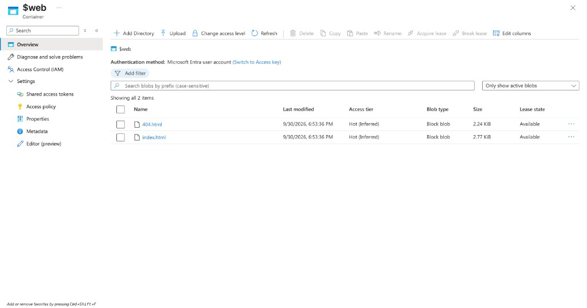 -->

### Step 6: Test the site

1. Open the primary endpoint from step 3. The home page loads.
2. Add `/does-not-exist` to the end of the address. The custom 404 page loads.

<!-- 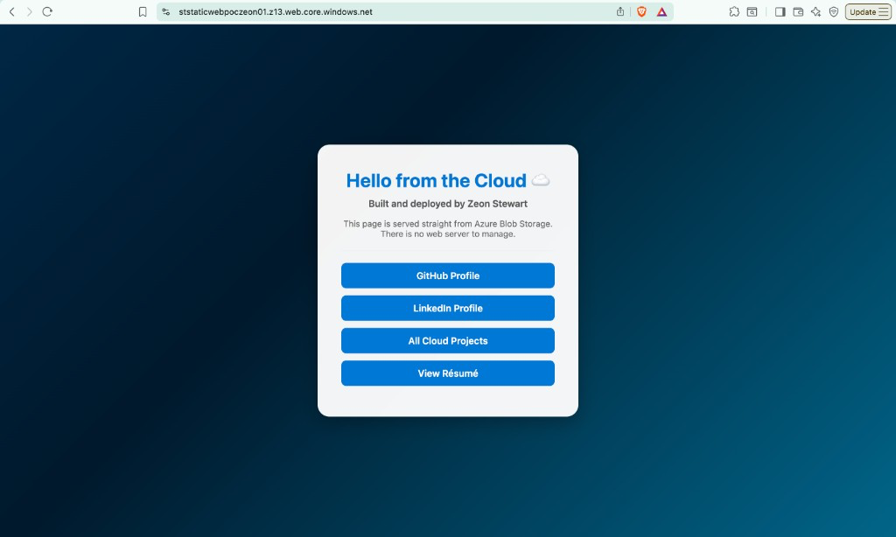 -->
<!-- 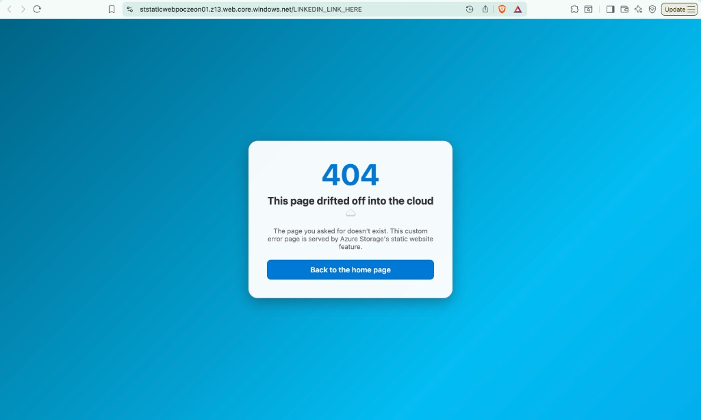 -->

### Step 7: Register an app for GitHub Actions

*Automated by `az ad app create` and `az ad sp create` in `scripts/setup-oidc.sh`.*

If you already ran `setup-oidc.sh` for this repository, skip steps 7-10: you would end up with two app registrations with the same name, and the repository can only point at one of them.

1. Search for **Microsoft Entra ID**, open **App registrations**, and select **+ New registration**.
2. **Name:** `github-actions-<repo-name>`
3. **Supported account types:** Accounts in this organizational directory only.
4. Select **Register**. The portal also creates the service principal (listed under **Enterprise applications**).
5. From the **Overview** page, note the **Application (client) ID** and **Directory (tenant) ID**. Do not paste them anywhere public.

<!-- 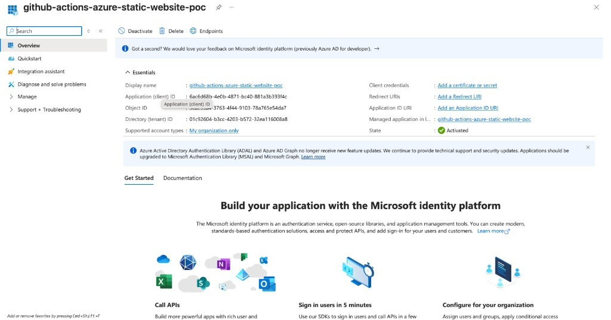 -->

### Step 8: Add the federated credential

*Automated by `az ad app federated-credential create` in `scripts/setup-oidc.sh`.*

1. In the app registration, open **Certificates & secrets > Federated credentials** and select **+ Add credential**.
2. **Federated credential scenario:** Other issuer.
3. **Issuer:** `https://token.actions.githubusercontent.com`
4. **Value (subject identifier):** the exact subject GitHub sends. For newer repositories this includes owner and repository IDs, for example `repo:zsociety47@122703085/azure-static-website-poc@1396638213:environment:production`. Get yours with:
   ```bash
   gh api repos/<owner>/<repo>/actions/oidc/customization/sub --jq .sub_claim_prefix
   ```
   then add `:environment:production` to the end.
5. **Name:** `github-production`. **Audience:** `api://AzureADTokenExchange` (the default).
6. Select **Add**.

> The **GitHub Actions deploying Azure resources** scenario in the same list builds the older name-only subject (`repo:owner/name:environment:production`). Newer repositories no longer send that format, so sign-in fails with `AADSTS700213: No matching federated identity record found`. Using **Other issuer** with the exact subject avoids this.

<!-- 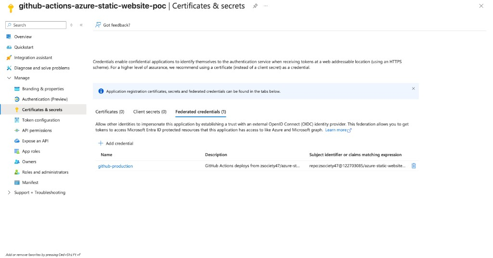 -->

### Step 9: Grant the app access to the storage account only

*Automated by `az role assignment create --assignee-principal-type ServicePrincipal` in `scripts/setup-oidc.sh`.*

1. Open the storage account, then **Access control (IAM) > + Add > Add role assignment**.
2. **Role:** Storage Blob Data Contributor.
3. **Members:** select **+ Select members**, search for `github-actions-<repo-name>`, select it, then **Select**.
4. Select **Review + assign** twice.

<!-- 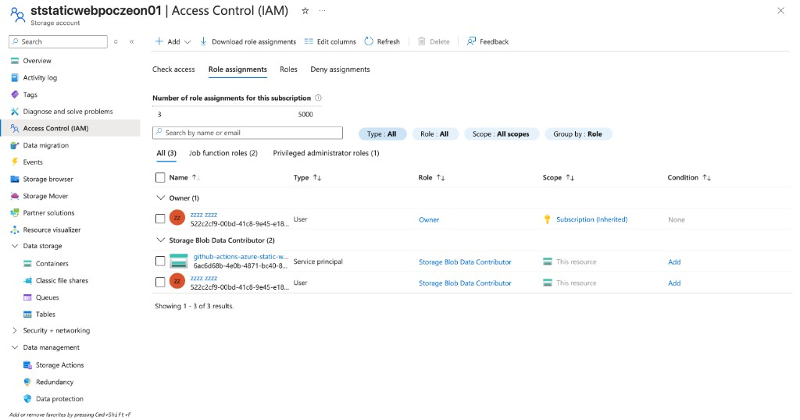 -->

### Step 10: Save the values in GitHub

*Automated with `gh secret set` and `gh variable set` in `scripts/setup-oidc.sh`.*

1. In the GitHub repository, open **Settings > Secrets and variables > Actions**.
2. **Secrets** tab, **New repository secret** for each: `AZURE_CLIENT_ID`, `AZURE_TENANT_ID`, and `AZURE_SUBSCRIPTION_ID` (found on the subscription's **Overview** page in the portal).
3. **Variables** tab, **New repository variable** for each: `STORAGE_ACCOUNT_NAME` (`ststaticwebpoc<suffix>`) and `SITE_URL` (the primary endpoint from step 3).

GitHub never shows a secret's value again after you save it, only its name.

<!--  -->

### Step 11: Push a change and watch it deploy

*This is what `.github/workflows/deploy.yml` does on every push to `main`.*

1. Make a small visible change in `site/index.html`. This repository keeps a "Deployed automatically via GitHub Actions" line commented out for the demo; remove the `<!--` and `-->` around it, or edit any text.
2. Commit and push the change to `main`.
3. Open the repository's **Actions** tab. The **Deploy static website** run signs in to Azure and uploads `site/`, and turns green in under a minute.
4. Hard-refresh the live site (Cmd+Shift+R on a Mac, Ctrl+Shift+R on Windows). The new line is there.

<!--  -->

### Step 12: Clean up when you're done

A storage account this size costs cents per month, but delete it when you no longer need it.

1. **Resource group:** open **Resource groups > rg-staticweb-poc-`<suffix>` > Delete resource group**, type the name to confirm, and select **Delete**. This removes the storage account and the site.
2. **App registration (only if you did step 7 by hand):** open **Microsoft Entra ID > App registrations > github-actions-`<repo-name>` > Delete**. This also removes its service principal and federated credential.
3. **GitHub values (only if you did step 10 by hand):** in the repository, open **Settings > Secrets and variables > Actions** and delete the three secrets on the **Secrets** tab and the two variables on the **Variables** tab.

If you built everything with the scripts, `./scripts/teardown.sh` does all three; see [Automated setup](#automated-setup).

The live site linked at the top of this page is kept running on purpose as a working demo.

<!-- 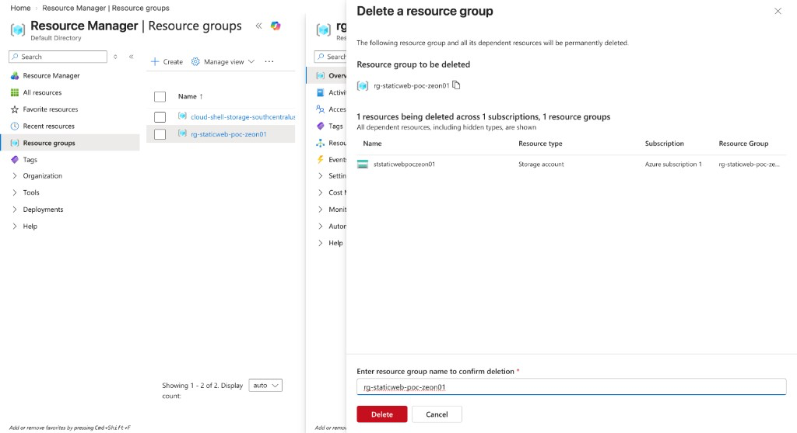 -->

---

## Automated setup

The same build as the Project Steps, in three commands.

**Prerequisites:** an Azure subscription where you are Owner (or Contributor plus User Access Administrator), the Azure command-line interface (CLI) signed in with `az login`, and the GitHub CLI (`gh`) signed in with `gh auth login`.

**1. Create the Azure resources and upload the site** (steps 1-6)

```bash
./scripts/deploy.sh <suffix>        # suffix: 2-8 lowercase letters or digits, e.g. zs01
```

The script prints the live site address and the storage account name.

**2. Let GitHub Actions sign in to Azure** (steps 7-10)

```bash
./scripts/setup-oidc.sh <github-owner>/<repo> <storage-account-name>
```

The script removes any existing values from the repository first, creates the identity GitHub signs in as, then asks whether to save the values the workflow needs in your repository: three secrets (`AZURE_CLIENT_ID`, `AZURE_TENANT_ID`, `AZURE_SUBSCRIPTION_ID`) and two variables (`STORAGE_ACCOUNT_NAME`, `SITE_URL`). Answer **Y** and it saves them for you without showing the secret values. Answer **n**, or run it without the GitHub CLI signed in, and it prints the values with a link to the GitHub settings page to paste them into by hand.

Run it again after every rebuild: each new app registration has a new client ID.

**3. Push to `main`** (step 11). The workflow uploads `site/` and the live site updates within a minute.

**4. Tear it down when you're done** (step 12)

```bash
./scripts/teardown.sh <suffix> <github-owner>/<repo>
```

This deletes the resource group (storage account and site), the app registration GitHub signed in as, and the secrets and variables `setup-oidc.sh` saved in your repository. Your site's link stops working straight away. Run it from inside your clone and you can leave off `<github-owner>/<repo>`.

---

## Architecture

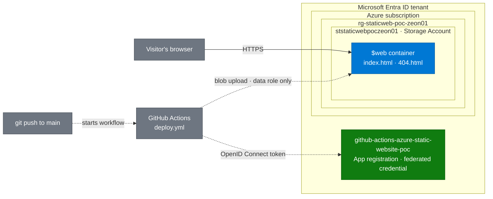

**How to read this diagram**

- **Solid arrow:** how visitors reach the site.
- **Dashed arrows:** how code gets there.
- **Blue:** Azure resources. **Gray:** outside systems (visitors and GitHub). **Green:** identity, the part that replaces passwords.

*GitHub Actions signs in with a short-lived OpenID Connect token instead of a stored password, and its only permission is to upload files to this one storage account.*

*Diagram follows the [shared diagram standard](https://github.com/zsociety47/cloud-projects/blob/main/standards/DIAGRAM-STANDARD.md).*

---

## Hypothesis

A static website can be hosted on Azure Storage with no web server to manage, and deployed from GitHub Actions without storing any long-lived credentials, using only a narrowly scoped role on a single storage account.

## Success criteria

| # | Criterion | How it is checked | Result |
|---|-----------|-------------------|--------|
| 1 | The site loads over Hypertext Transfer Protocol Secure (HTTPS) from the storage account's static website endpoint | Open the live site link | ✅ |
| 2 | Missing pages return the custom 404 page | Visit `/does-not-exist` | ✅ |
| 3 | A push to `main` updates the live site with no manual steps | Uncomment the "Deployed automatically" line, push, refresh | ✅ |
| 4 | No passwords, keys, or connection strings are stored in GitHub or the repository | Review repository secrets and workflow | ✅ |
| 5 | The deploy identity can only write to this one storage account | Review its role assignments in Azure | ✅ |
| 6 | The whole environment is created and removed by scripts | Run `deploy.sh`, `setup-oidc.sh`, and `teardown.sh` | ✅ |

## What's in this repository

```
.
├── site/
│   ├── index.html          Home page
│   └── 404.html            Custom "page not found" page
├── docs/
│   └── images/             Screenshots used in this README
├── scripts/
│   ├── deploy.sh           Creates the resource group and storage account, enables hosting, uploads site/
│   ├── setup-oidc.sh       Creates the identity GitHub Actions signs in as, and its permissions
│   ├── teardown.sh         Deletes everything the two scripts above created
│   └── lib/
│       └── github-values.sh  Shared checks for the GitHub secrets and variables
└── .github/
    ├── workflows/
    │   └── deploy.yml      Continuous integration and continuous deployment (CI/CD) pipeline
    └── dependabot.yml      Weekly check for newer GitHub Actions versions
```

## Security choices

- **OpenID Connect instead of stored secrets.** Each workflow run gets a token from GitHub that expires in minutes. Azure trusts it only if it comes from this repository deploying to the `production` environment.
- **Least privilege with role-based access control (RBAC).** The deploy identity has only the Storage Blob Data Contributor role, scoped to this one storage account. It cannot change settings, delete the account, or reach anything else in the subscription.
- **No storage account keys.** Both the scripts and the workflow upload with `--auth-mode login`, which uses the signed-in identity's role instead of the account's master key.
- **Hardened storage account.** HTTPS only, minimum Transport Layer Security (TLS) version 1.2, and anonymous public access to blobs turned off. The static website endpoint still serves the site.
- **Minimal workflow permissions.** The workflow token can only read the code and request an OpenID Connect token.

## Cost and redundancy

The storage account uses locally redundant storage (LRS): three copies of the data in one datacenter. It is the cheapest option and costs cents per month for a site this size. Production sites might choose zone-redundant storage (ZRS), which spreads copies across three availability zones in a region, or geo-redundant storage (GRS), which adds a second copy in another region.

## Going further

- **Custom domain with HTTPS:** put Azure Front Door, Microsoft's global content delivery network (CDN) and entry point, in front of the static website endpoint.
- **Infrastructure as code:** replace the scripts with a Bicep template.

---

## Technical findings

*For engineers: what actually happened while building this, including the errors.*

- **GitHub's OpenID Connect subject format has changed, and most guides haven't caught up.** The first real deploy failed with `AADSTS700213: No matching federated identity record found`. New GitHub repositories now include permanent owner and repository IDs in the token subject (`repo:zsociety47@122703085/azure-static-website-poc@1396638213:environment:production`), but the federated credential used the older name-only format (`repo:zsociety47/azure-static-website-poc:environment:production`) that most tutorials still show. The workflow log printed the subject GitHub actually sent, which made the mismatch easy to spot. `setup-oidc.sh` now asks GitHub for the exact subject, so it works with both formats.
- **New role assignments are not instant, and the delay varies.** The first upload in `deploy.sh` was refused with "You do not have the required permissions" seconds after the Storage Blob Data Contributor role was granted. It succeeded after 30 seconds on the first build and after a few minutes on a rebuild. `deploy.sh` now grants the role before enabling static website hosting, so the wait overlaps with other work, then checks every 15 seconds for up to 10 minutes with a short progress message. The error message also suggested switching to `--auth-mode key`, which would have worked but defeated the point of the project.
- **Being Owner of the subscription is not the same as being able to write files.** Owner covers management actions such as creating the storage account and turning on static website hosting, but uploading blobs with your own identity needs a separate data role. Keeping those two kinds of permission apart is what lets the GitHub identity hold only a data role on one storage account, with no power to change or delete anything else.
- **The pipeline fails closed.** The very first push ran before any Azure credentials existed in GitHub. The workflow stopped at the sign-in step and never reached the upload, so a missing or broken identity can't lead to a partial or unauthorized deploy.
- **`az storage blob upload-batch` only adds and overwrites files.** Deleting a page from `site/` leaves the old copy live on Azure. A future version could use `az storage blob sync` with `--delete-destination true` to mirror the folder exactly.
